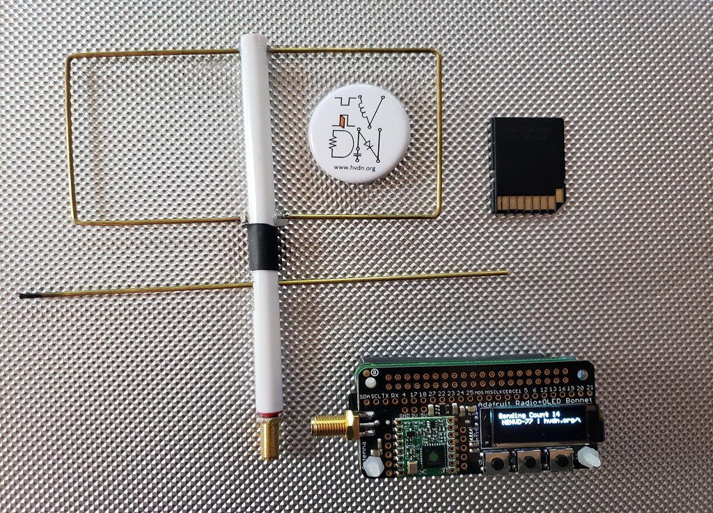
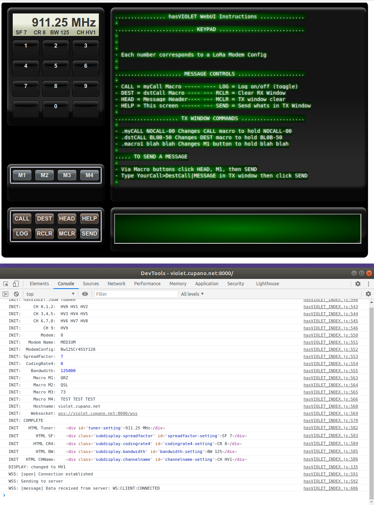

# What is HASviolet

Read the fine [wiki](https://github.com/hudsonvalleydigitalnetwork/hasviolet/wiki/HASviolet) first



UPDATED: 15 July 2022

# Quick Start

The quickest way to get started with HASviolet is to

- Buy the [hardware](http://www.adafruit.com/wishlists/503542)
- Install [Raspberry Pi OS Lite](https://www.raspberrypi.org/software/operating-systems/) on a microSD card using [Raspberry Pi Imager](https://www.raspberrypi.org/software/)
- Log in as Pi
- Clone the [repo](https://github.com/hudsonvalleydigitalnetwork/hasviolet.git)
- cd into the repo directory and run **./HASviolet install**
- After install run **HASviolet config** to configure HASviolet
- Read the fine [wiki](https://github.com/hudsonvalleydigitalnetwork/hasviolet/wiki/User-Guide-(v0.50))

# Introducing the WebUI



## Overview
A WebUI is available. To install it run **HASViolet websox install**. A web SSL daemon listening on port 8000 is installed under systemd. **HASviolet websox stop**, **HASviolet websox start**, **HASviolet websox remove** can be used to stop/start/remove the server respectively.

When a new client connects the following occur in order;
- Client is served **HASviolet_LOGIN.html** made pretty with **HASviolet_LOGIN.css**
- Client is required to authenticate using ID/password in **HASviolet.pwf** file
- Once authenticated, the client is redirected to the Dashboard **HASviolet_INDEX.html** made pretty with **HASviolet_INDEX.css**.
- After the page is made pretty, **HASviolet_INDEX.html** tells the browser to load javascript from **HASviolet.js** 
- Javascript instructs the client to the server and load **HASviolet.json**

## Server flow

The server runs two async processes;

- Tornado Web Framework providing web and websocket services
- LoRa Transceiver function (HASviolet)

When HASviolet sees a LoRa packet, it captures the message and sends a WebSocket client broadcast. When a TX request comes from the browser (client) via WebSockets, **HASit.transmit** function is called, transmits the LoRa packet and then trips a conditional inner-loop to restart recieving. We also use this trick if we want to change channels from the client which includes frequency, spreadfactor, coding, and bandwidth.

## Details

### SSL Certificate and Key (HASviolet.crt and HASviolet.key)
The framework uses SSLv3/TLS only. A untrusted self-signed certificate and server key are provided **HASviolet.crt** and **HASviolet.key**, respectively. But it is HIGHLY RECOMMENDED these be replaced with your own trusted credentials. Know until you have done that you will see (harmless) iostream errors from the websocket server like the following.

[SSL: SSLV3_ALERT_CERTIFICATE_UNKNOWN] sslv3 alert certificate unknown (_ssl.c:852)

### User Authentication
**HASviolet.pwf** is a password file that stores ID and password pairs. An account management program is included called **HASviolet_account.py** to generate your own ID and password pairs into the password file. Passwords are stored as hashes to protect them. The password file is pre-populated with three ID:Password pairs provided as examples only and should be immediately replaced using the account program.

### FAVICON.ICO
An annoying thing all browsers do is look for a **FAVICON.ICO** file. The file is a small image icon  that some sites host and is displayed in your browser tab with  the title of the web page. I created one cause I go tired of seeing an error in the Browser inspect console while I was building the app.  If you want to create your own FAVICON.ICO, easiest way is from the following website that generates them.

 https://www.favicon.cc/


### Index CSS code (HASviolet_INDEX.css)

The CSS code is what makes the WebUI shine. It is commented into sections that reference the grid containers they serve. The Tuner-Container CSS is the most complex out of all the sections. To best grasp CSS use start with reviewing Buttson CSS and Controls CSS sections. They serve the radio-controls, cmd-controls, and msg-control containers.

### Login CSS code (HASviolet_LOGIN.css)

The CSS code for **HASviolet_LOGIN.html**

### JS Code
This code is loaded and run by the browser. To see it in action on the browser, after loading the web page (in Chrome) right click on empty page space and select **Inspect** then click on the **Console tab** The code generates alot of console.log infor here.


## Modem Notes

A confusing subject but hope the following tranlsates well;
```
rf95.setFrequency(911);
  rf95.setSpreadingFactor(7);
  rf95.setSignalBandwidth(125E3);
  rf95.setCodingRate4(5);
  rf95.setTxPower(20,false);
/*
  //Different Combination for distance and speed examples: 
  Example 1: Bw = 125 kHz, Cr = 4/5, Sf = 128chips/symbol, CRC on. Default medium range = Bw125Cr45Sf128
    rf95.setSignalBandwidth(125000);
    rf95.setCodingRate4(5);
    rf95.setSpreadingFactor(7);
  Example 2: Bw = 500 kHz, Cr = 4/5, Sf = 128chips/symbol, CRC on. Fast+short range = Bw500Cr45Sf128?
    rf95.setSignalBandwidth(500000);
    rf95.setCodingRate4(5);
    rf95.setSpreadingFactor(7);
  Example 3: Bw = 31.25 kHz, Cr = 4/8, Sf = 512chips/symbol, CRC on. Slow+long range = Bw500Cr48Sf128?
    rf95.setSignalBandwidth(31250);
    rf95.setCodingRate4(8);
    rf95.setSpreadingFactor(9);
  Example 4: Bw = 125 kHz, Cr = 4/8, Sf = 4096chips/symbol, CRC on. Slow+long range = Bw125Cr48Sf512?
    rf95.setSignalBandwidth(125000);
    rf95.setCodingRate4(8);
    rf95.setSpreadingFactor(12); 
```
